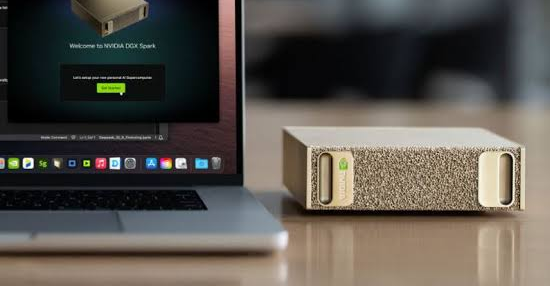
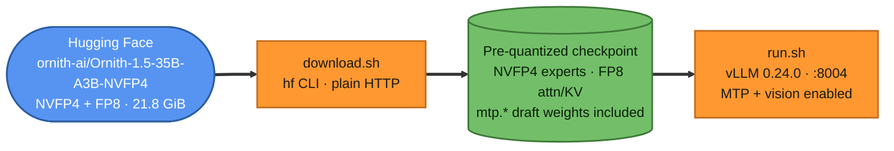
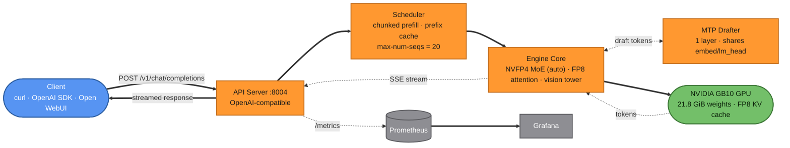

<div align="center">



# Ornith-1.5-35B-A3B (NVFP4 + FP8 + MTP) on NVIDIA DGX Spark (GB10)

**Serve an official 4-bit MoE with multi-token prediction and vision: 20 concurrent users, 262K context, image input**

[](https://huggingface.co/ornith-ai/Ornith-1.5-35B-A3B-NVFP4)
[](#configuration-reference)
[](https://github.com/vllm-project/vllm)
[-76B900)](https://www.nvidia.com/en-us/products/workstations/dgx-spark/)
[](https://www.apache.org/licenses/LICENSE-2.0)
[](#configuration-reference)

</div>

---

## Overview

This repository contains the pipeline used to run
[**`ornith-ai/Ornith-1.5-35B-A3B-NVFP4`**](https://huggingface.co/ornith-ai/Ornith-1.5-35B-A3B-NVFP4)
on a single **NVIDIA DGX Spark (GB10, Blackwell, 128GB unified memory)**, replacing an earlier
[Qwen3.8-35B-A3B deployment](https://github.com/Hitheshkaranth/Qwen-3_8_A3B_Model_DGX_Spark_Setup)
on the same box. Ornith-1.5 is a `Qwen3_5Moe` fine-tune (35B total / 3B active MoE) whose
self-reported scores beat Qwen3.6-35B-A3B by roughly 15 points on Terminal-Bench 2.1 and 10 points
on SWE-bench Pro.

Unlike Qwen3.8, **this checkpoint is officially pre-quantized by ornith-ai** (ModelOpt
MIXED_PRECISION: W4A16 NVFP4 routed + shared experts, FP8 attention, FP8 KV) — there is no local
quantization step, just download and serve. It also ships two capabilities the previous Qwen3.8
deployment didn't have:

- **Multi-token prediction (MTP)** speculative decoding — the checkpoint carries its own
  `mtp.*` draft-model weights, so vLLM can self-speculate with no separate draft model.
- **A real vision tower** (333 `model.visual.*` weights) — this is a genuine vision-language
  checkpoint, not a text-only distill, so it accepts image input.

> Every number in this README was measured on the deployment itself. See
> [Benchmarks](#benchmarks) for methodology and raw data in [`benchmarks/`](benchmarks/).

## Table of Contents

- [Architecture](#architecture)
- [Hardware & Software Requirements](#hardware--software-requirements)
- [Quick Start](#quick-start)
- [Configuration Reference](#configuration-reference)
- [Hosting on This System](#hosting-on-this-system)
- [Vision & PDF Support](#vision--pdf-support)
- [Benchmarks](#benchmarks)
  - [Throughput & MTP Speculative Decoding](#throughput--mtp-speculative-decoding)
  - [Reasoning & Output Length](#reasoning--output-length)
  - [Knowledge: MMLU-Pro](#knowledge-mmlu-pro)
- [Live Monitoring](#live-monitoring)
- [Client Usage](#client-usage)
- [Repository Layout](#repository-layout)
- [Troubleshooting](#troubleshooting)
- [Credits & License](#credits--license)

---

## Architecture

### Build pipeline



No quantization step and no accuracy-verification gate are needed here — unlike the Qwen3.8
deployment, ornith-ai ships the NVFP4/FP8 checkpoint directly.

### Request flow



## Hardware & Software Requirements

| Component | Requirement | Notes |
|---|---|---|
| GPU | 1x NVIDIA Blackwell GPU (SM ≥ 12.0) | Tested on **DGX Spark (GB10)**, compute capability 12.1 |
| Memory | ≥ 32GB GPU-addressable memory | Weights take 21.8 GiB; GB10's 128GB is unified CPU+GPU memory |
| Driver | NVIDIA driver with CUDA 13.x support | `580.173.02` used here |
| OS | Linux (aarch64 or x86_64) | Ubuntu 24.04.4, kernel 6.17.0-1031-nvidia |
| Docker | Docker Engine + NVIDIA Container Toolkit | `--gpus all` must work |
| NGC | Pull access to `nvcr.io/nvidia/vllm:26.07-py3` | `docker login nvcr.io` if needed |
| Disk | ~25GB free | 21.8 GiB NVFP4 checkpoint, no BF16 source needed |
| Network | Outbound HTTPS to huggingface.co | ~22 GB download on first run |

## Quick Start

**One line**, on any single-Blackwell-GPU box with Docker and the NVIDIA Container Toolkit
already set up:

```bash
curl -fsSL https://raw.githubusercontent.com/Hitheshkaranth/Ornith-1.5_A3B_Model_DGX_Spark_Setup/main/install.sh | bash
```

Prefer to clone it yourself first? Same result:

```bash
git clone https://github.com/Hitheshkaranth/Ornith-1.5_A3B_Model_DGX_Spark_Setup.git && cd Ornith-1.5_A3B_Model_DGX_Spark_Setup
./download.sh && ./run.sh
```

> [!WARNING]
> On GB10, run **one** 0.70-utilization vLLM server at a time. If another model is already
> serving, stop it first (`docker stop <container>`).

## Configuration Reference

| Flag | Value | Why |
|---|---|---|
| `--gpu-memory-utilization` | `0.70` | Hard ceiling on this unified-memory machine; higher values made concurrency collapse under load. |
| `--max-model-len` | `262144` | The model's native maximum context. |
| `--max-num-seqs` | `20` (was 16, matching the previous Qwen3.8 deployment) | Raised after the KV cache logged `Maximum concurrency for 262,144 tokens per request: 19.75x`, showing headroom for 20 concurrent sequences even at full context. |
| `--max-num-batched-tokens` | `8192` | Keeps prefill batching efficient under concurrent load. |
| `--enable-prefix-caching` | on | Reuses KV for shared system prompts and multi-turn chats. |
| `--kv-cache-dtype` | `fp8` | Halves KV memory versus BF16. |
| `--speculative-config` | `{"model": "<same checkpoint>", "num_speculative_tokens": 1}` | **MTP speculative decoding.** The checkpoint ships `mtp.*` weights (`mtp_num_hidden_layers: 1`, 785 tensors); vLLM auto-detects the `qwen3_5_mtp` draft architecture from `model_type=qwen3_5_moe` and shares the target model's embedding/lm_head with the draft. Observed ~86-88% draft acceptance rate in production. |
| `--moe-backend` | *(unset → `auto`)* | **Deliberately not forced to `marlin`.** The MTP drafter's expert layers are unquantized BF16, and Marlin only supports quantized MoE — forcing marlin crashed the drafter on load (`moe_backend='marlin' is not supported for unquantized MoE`). `auto` still picks marlin for the main model's NVFP4 experts on this GPU (no native FP4 support). |
| `--language-model-only` | *(unset)* | **Deliberately not set.** This checkpoint has a real vision tower (333 `model.visual.*` weights + `vision_config`); setting this flag (copied from the text-only Qwen3.8 config) silently disabled all image input (`At most 0 image(s) may be provided`). |
| `--served-model-name` | `ornith-1.5-35b-a3b` | The name clients put in `"model"`. |
| `--reasoning-parser` | `qwen3` | Moves the `<think>` block into `message.reasoning` instead of the answer. |
| `--enable-auto-tool-choice` / `--tool-call-parser` | `qwen3_coder` | OpenAI-style function calling. |

Recommended sampling: `temperature=0.6, top_p=0.95, top_k=20`. Allow a generous `max_tokens`
(16,384+) since every answer starts with a reasoning block.

## Hosting on This System

This is how the model is hosted on the DGX Spark, sharing the existing metering gateway and
monitoring stack that the [Qwen3.8 deployment](https://github.com/Hitheshkaranth/Qwen-3_8_A3B_Model_DGX_Spark_Setup)
documents in full (`docs/GATEWAY.md` there covers setup, Tailscale keys and gateway operations —
not duplicated in this repo since it's shared infrastructure, not per-model).

### Services on the box

| Port | Container | What it is |
|---|---|---|
| `8000` | `vllm` | Qwen3.6-35B-A3B-NVFP4 (stopped; kept for reference/rollback) |
| `8002` | `vllm-qwen38-a3b` | Qwen3.8-35B-A3B (stopped 2026-09-26, replaced by this deployment) |
| **`8004`** | **`vllm-ornith-a3b`** | **This server**: Ornith-1.5-35B-A3B, model name `ornith-1.5-35b-a3b` (localhost + docker bridge only) |
| `8080` | `llm-gateway` (systemd) | Metering gateway: the only client entry point; per-user/per-client token metrics |
| `3000` | `open-webui` (systemd) | Open WebUI, default model set to `ornith-1.5-35b-a3b` |
| `3001` | `vllm-grafana` | Grafana dashboards |
| `9090` | `vllm-prometheus` | Prometheus, scraping `:8004` (and other vLLM ports) in the `vllm` job |
| `9400` / `9100` | `vllm-dcgm-exporter` / `vllm-node-exporter` | GPU / host metrics |

**Clients don't call vLLM directly.** It's published only on `127.0.0.1` and the docker bridge
(`BIND_ADDRS="127.0.0.1 172.17.0.1" ./run.sh`, the default), and every client goes through the
**metering gateway** at `:8080`. The gateway polls `/v1/models` on each backend and routes by
model name, so swapping models needs no gateway config change beyond adding the new port once —
already done here (`GATEWAY_BACKENDS` includes `:8004`; Prometheus's `vllm` job includes it too).

### Switching models

```bash
# stop whatever's running, then:
cd Ornith-1.5_A3B_Model_DGX_Spark_Setup && ./run.sh   # ready in ~5 min (weights + MTP drafter + vision tower + compile)
```

Only the active container should keep `--restart unless-stopped` (this repo's `run.sh` defaults
to `--restart no`, matching the "manually swapped" workflow used on this box).

### Open WebUI default model

Open WebUI persists its default/pinned model in its own sqlite `config` table
(`ui.default_models`, `ui.default_pinned_models`, `ui.model_order_list`), which **overrides** the
`DEFAULT_MODELS` environment variable once set. Swapping the default model requires updating both
the systemd unit's env var (for a fresh install) and the existing database (for an already-deployed
instance) — see [Troubleshooting](#troubleshooting).

## Vision & PDF Support

Unlike the text-only Qwen3.8 deployment, this model accepts image input directly:

```bash
curl http://localhost:8080/v1/chat/completions \
  -H "Authorization: Bearer $GATEWAY_KEY" -H "Content-Type: application/json" \
  -d '{"model":"ornith-1.5-35b-a3b","messages":[{"role":"user","content":[
        {"type":"text","text":"What is in this image?"},
        {"type":"image_url","image_url":{"url":"data:image/png;base64,<...>"}}
      ]}]}'
```

Confirmed working end to end with a real test image through the gateway.

**PDFs work too, through Open WebUI's existing pipeline** — not through the model's API directly
(vLLM's OpenAI-compatible endpoint has no native PDF/file content type, only text and
`image_url`). Open WebUI extracts PDF text locally with `pypdf`, embeds it with a local
`sentence-transformers` model, and retrieves the top-k relevant chunks into the prompt. Verified
end to end by running a real PDF through Open WebUI's own extraction code path. Embedded images
inside PDFs are **not** currently extracted (`rag.pdf_extract_images` is off — enabling it needs
an additional `rapidocr-onnxruntime` dependency that isn't installed, and would do OCR on those
images rather than route them through this model's vision tower).

## Benchmarks

Both models ran on the same box, one at a time, with identical prompts. Scripts and raw results
are in [`benchmarks/`](benchmarks/) (copied from the Qwen3.8 repo's benchmark suite, with a
`GATEWAY_KEY` auth header added to `reasoning_bench.py` and `throughput_bench.py` since vLLM now
requires a bearer key on `/v1/*`).

### Throughput & MTP Speculative Decoding

| Metric | Qwen3.8-35B-A3B (no MTP) | **Ornith-1.5-35B-A3B (this repo, MTP on)** |
|---|---:|---:|
| Decode, 1 user | 56.1 tok/s | **82.7 tok/s** (+47%) |
| Decode, 16 users (aggregate) | 372.7 tok/s | 351.7 tok/s |
| Decode, 16 users (per user) | 23.3 tok/s | 22.6 tok/s |
| Checkpoint size | 20.23 GiB | 21.81 GiB |
| KV cache (fp8) | 6.05M tokens | 5.29M tokens |
| Max concurrency at 262K context | 23.1x | 20.2x |
| Cold start to ready | 258 s | 290 s |

MTP gives a large single-stream win (+47% at 1 user) since there's a full model's worth of
spare decode bandwidth to spend on speculation. The aggregate throughput at 16 users is very
slightly lower than Qwen3.8's, likely because the drafter's extra forward pass competes for the
same compute once the batch is already saturating the GPU — a smaller win when there's no slack
to speculate into. In live production traffic, the SpecDecoding metrics show a consistent
**~86-88% per-position draft-acceptance rate** (`vllm:spec_decode` / engine logs), meaning the
1-token draft is right the large majority of the time.

Method: every request generates exactly 512 tokens (`ignore_eos`), after one warm-up request
([`throughput_bench.py`](benchmarks/throughput_bench.py) ·
[`throughput_result.json`](benchmarks/throughput_result.json)).

### Reasoning & Output Length

Measured with the model card's thinking-mode sampling (`temperature=0.6, top_p=0.95, top_k=20`)
and 16 requests in flight:

| Test | **Ornith-1.5-35B-A3B (this repo)** | Qwen3.8-35B-A3B |
|---|---:|---:|
| **GSM8K**, first 100 test problems | 98% (98/100) | **99%** (99/100) |
| avg / max output tokens | 384 / 3,630 | 303 / 1,251 |
| hit the 16,384-token limit | 0 | 0 |
| **MATH-500**, first 100 with integer answers | **97%** (97/100) | 94% (94/100) |
| avg / max output tokens | 1,937 / 16,384 | 2,263 / 16,384 |
| hit the 16,384-token limit | 3 | 6 |
| **Long-form**, 4 prompts, 32,768-token cap | avg 17,804 tokens | avg 20,723 tokens |

Ornith trades a single point on GSM8K for three points on the harder MATH-500 benchmark, with
fewer truncated answers. Raw results:
[`reasoning_result_ornith.json`](benchmarks/reasoning_result_ornith.json) · script:
[`reasoning_bench.py`](benchmarks/reasoning_bench.py).

### Knowledge: MMLU-Pro

[MMLU-Pro](https://huggingface.co/datasets/TIGER-Lab/MMLU-Pro) (TIGER-Lab, NeurIPS 2024): 10
options per question, so random guessing scores 10%. Stratified sample of **700 questions** (50
per category, fixed seed), zero-shot, thinking on, `max_tokens` 16,384, 8 requests in flight
through the metering gateway.

| | **Ornith-1.5-35B-A3B (this repo)** | Qwen3.8-35B-A3B |
|---|---:|---:|
| **MMLU-Pro accuracy** | **81.1%** (568/700, 95% CI ±2.9) | 80.9% (566/700, 95% CI ±2.9) |
| unparsed / truncated answers | 37 (5.3%) | 11 (1.6%) |
| avg output tokens | 2,273 | 1,155 |

| Category | Ornith | Qwen3.8 | Category | Ornith | Qwen3.8 |
|---|---:|---:|---|---:|---:|
| Math | 94% | 94% | Psychology | 88% | 82% |
| Physics | 94% | 92% | Business | 84% | 82% |
| Biology | 92% | 94% | Philosophy | 80% | 76% |
| Computer science | 92% | 86% | Health | 76% | 74% |
| Economics | 92% | 90% | History | 68% | 68% |
| Chemistry | 90% | 86% | Other | 66% | 68% |
| | | | Law | 62% | 70% |
| | | | Engineering | 58% | 70% |

Overall accuracy is essentially tied (81.1% vs 80.9%, well within the ±2.9-point sampling error
of either single run), but the two models trade strength by category: Ornith is stronger on
computer science and psychology, Qwen3.8 is stronger on law and engineering. Ornith also
produced roughly 2x the average output tokens per answer and 3x the unparsed-answer rate,
suggesting it reasons longer and occasionally fails to land on the requested
`ANSWER: <letter>` format — a prompt-format issue more than a knowledge gap.

Raw results: [`knowledge_result_ornith.json`](benchmarks/knowledge_result_ornith.json) (summary) ·
[`knowledge_result_ornith.jsonl`](benchmarks/knowledge_result_ornith.jsonl) (per question) ·
script: [`knowledge_bench.py`](benchmarks/knowledge_bench.py). This run took several hours of
wall time interleaved with three server restarts (for MTP, vision, and the max-num-seqs change)
and live user traffic sharing the same concurrency slots, so the wall-clock figure isn't a speed
measure — use the throughput benchmark above for that.

## Live Monitoring

The server exposes Prometheus metrics at `/metrics`, scraped in the same `vllm` job as the other
vLLM ports on this box; Grafana's panels key off the `model`/`model_name` labels, so this model's
traffic appears automatically with no dashboard changes needed:

```yaml
scrape_configs:
  - job_name: vllm
    static_configs:
      - targets: ["host.docker.internal:8000", "host.docker.internal:8002", "host.docker.internal:8004"]
```

If `prometheus.yml` is bind-mounted as a single file, run `docker restart <prometheus>` after
editing it — a SIGHUP won't pick up a file replaced by `sed -i`.

## Client Usage

```python
from openai import OpenAI

client = OpenAI(api_key="<gateway key>", base_url="http://localhost:8080/v1")

resp = client.chat.completions.create(
    model="ornith-1.5-35b-a3b",
    messages=[{"role": "user", "content": "A snail climbs 3 m a day and slips 2 m a night in a 10 m well. How many days?"}],
    max_tokens=16384,
    temperature=0.6, top_p=0.95,
    extra_body={"top_k": 20},
)
print(resp.choices[0].message.reasoning)   # the <think> trace
print(resp.choices[0].message.content)     # the answer: 8
```

## Repository Layout

```
Ornith-1.5_A3B_Model_DGX_Spark_Setup/
├── README.md                        # this file
├── install.sh                       # one-line installer (curl | bash)
├── Dockerfile                       # nvcr vLLM 26.07 base + xgrammar patch
├── download.sh                      # fetches the official pre-quantized NVFP4 checkpoint
├── run.sh                           # builds the image and runs the server on :8004
├── benchmarks/
│   ├── throughput_bench.py          # decode tok/s at N concurrent users
│   ├── throughput_result.json       # raw results cited above (Ornith vs Qwen3.8)
│   ├── reasoning_bench.py           # GSM8K / MATH-500 accuracy + long-form length (+ gateway auth)
│   ├── reasoning_result_ornith.json # raw reasoning results cited above
│   ├── knowledge_bench.py           # MMLU-Pro accuracy (700-question stratified sample)
│   ├── knowledge_result_ornith.json # MMLU-Pro summary + per-category scores
│   └── knowledge_result_ornith.jsonl # MMLU-Pro per-question records (resume log)
└── assets/
    ├── ornith_logo.png              # from the model card
    ├── ornith_35b_eval.png          # official eval chart, from the model card
    └── dgx-spark-banner-new.png     # hardware banner
```

`models/` (the downloaded checkpoint, ~22 GiB) is git-ignored and Docker-ignored. The metering
gateway and Grafana/Prometheus configs live in the shared
[`llm-gateway`](https://github.com/Hitheshkaranth/Qwen-3_8_A3B_Model_DGX_Spark_Setup/blob/main/docs/GATEWAY.md)
setup on this box, not duplicated per model.

## Troubleshooting

| Symptom | Fix |
|---|---|
| `moe_backend='marlin' is not supported for unquantized MoE` (on startup, after "Loading drafter model...") | The MTP drafter's expert layers are unquantized. Don't pass `--moe-backend marlin`; leave it unset (`auto`). |
| `At most 0 image(s) may be provided in one prompt.` | The server was started with `--language-model-only`, which strips the vision tower. Remove that flag — this checkpoint has real vision weights. |
| `knowledge_bench.py` exits with `ModuleNotFoundError: No module named 'pyarrow'` | Run it via `uv run --no-project --with pyarrow python3 benchmarks/knowledge_bench.py ...` (its own docstring documents this), not plain `python3`. |
| Benchmark scripts get `401 Unauthorized` | vLLM requires the gateway's upstream key (`VLLM_API_KEY`). Pass `GATEWAY_KEY=<key>` in the environment when running `reasoning_bench.py` / `knowledge_bench.py` / `throughput_bench.py`. |
| Open WebUI still shows the old default model after changing `DEFAULT_MODELS` | Open WebUI persists `ui.default_models` in its sqlite `config` table, which overrides the env var once set. Stop the service, update `ui.default_models` / `ui.default_pinned_models` / `ui.model_order_list` directly in `webui.db`, then restart. |
| `CUDA out of memory` at startup | Another 0.70-utilization vLLM server is running. Stop it first. |
| Answers are cut off (`finish_reason: length`) | Raise `max_tokens`; the reasoning block comes first and can use several thousand tokens. |

## Credits & License

- Model: [ornith-ai/Ornith-1.5-35B-A3B-NVFP4](https://huggingface.co/ornith-ai/Ornith-1.5-35B-A3B-NVFP4) by ornith-ai.
- Serving engine: [vLLM](https://github.com/vllm-project/vllm), NVIDIA NGC vLLM container.
- Gateway, monitoring and Open WebUI infrastructure shared with
  [Qwen-3_8_A3B_Model_DGX_Spark_Setup](https://github.com/Hitheshkaranth/Qwen-3_8_A3B_Model_DGX_Spark_Setup).
- Model weights are distributed under **Apache 2.0**; see the
  [model card](https://huggingface.co/ornith-ai/Ornith-1.5-35B-A3B-NVFP4) for full terms.
- This repository's own scripts and config: Apache 2.0.

<div align="center">
<br>

</div>
