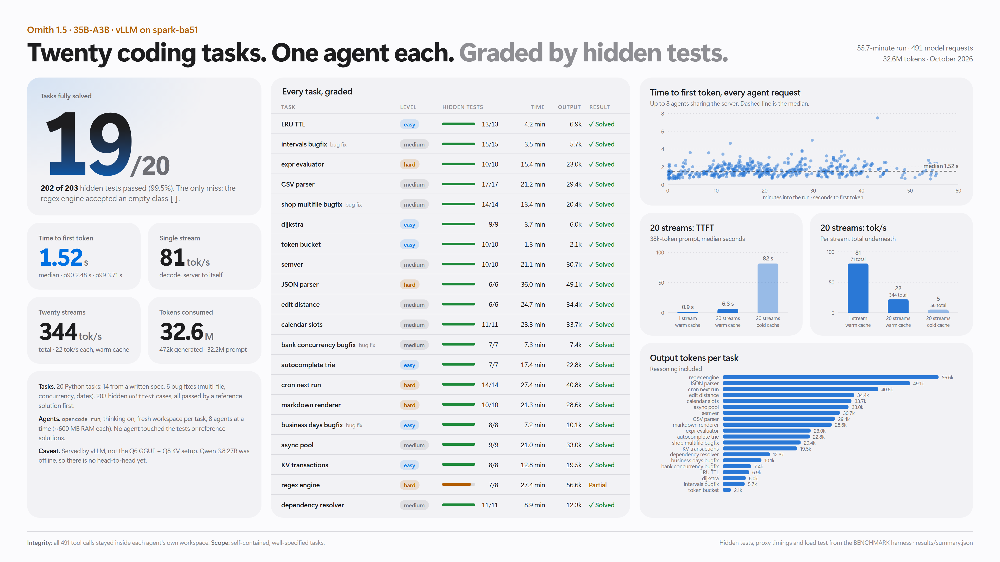

# Agentic Coding Benchmark (opencode)

Twenty Python programming tasks, each handed to its own headless [opencode](https://opencode.ai)
agent and graded by hidden unit tests the agent never sees. A logging proxy between opencode and
vLLM records time to first token, decode speed and token usage for every model request.



**Ornith-1.5-35B-A3B: 19/20 tasks solved, 202/203 hidden tests passed.**

## Layout

```
agentic_coding/
├── harness/
│   ├── taskdefs_a.py … taskdefs_d.py  # the 20 tasks: prompt, starter code, hidden tests, reference solution
│   ├── build_tasks.py                 # writes tasks/ and checks every reference solution passes 100%
│   ├── run_hidden.py                  # runs a hidden test file against a workspace, prints JSON
│   ├── proxy.py                       # OpenAI-compatible logging proxy (TTFT, usage per request)
│   ├── run_bench.py                   # launches the opencode agents, then scores them
│   ├── loadtest.py                    # TTFT / tok/s at 1, 8, 20 streams with ~38k-token prompts
│   ├── report.py                      # summary.json, per_task.csv, matplotlib dashboard
│   ├── build_page.py                  # injects the data into the HTML report + one-page poster
│   ├── report_template.html
│   └── poster_template.html
├── tasks/                             # generated by build_tasks.py (prompt, starter/, ref/, test_hidden.py)
└── results/
    ├── report_onepage.png             # one-page 4K summary
    ├── report_full.png                # long-form report
    ├── benchmark_dashboard.png        # matplotlib dashboard
    ├── report.html, poster.html       # the pages the PNGs were rendered from
    ├── summary.json, per_task.csv     # headline + per-task metrics
    └── ornith/
        ├── scores.json                # hidden-test result per task
        ├── requests.jsonl             # one line per model request (timing + usage)
        ├── loadtest.json              # 1/8/20-stream load test
        └── solutions/<task>/          # the code each agent left behind
```

## The tasks

| # | Task | Level | Kind |
|---|---|---|---|
| 01 | LRU cache with TTL | easy | from spec |
| 02 | Interval merging | medium | bug fix |
| 03 | Arithmetic expression evaluator (no `eval`/`ast`) | hard | from spec |
| 04 | RFC 4180 CSV parser + writer (no `csv`) | medium | from spec |
| 05 | Shop cart / coupons / tax, 3-file package | medium | bug fix |
| 06 | Dijkstra shortest path | easy | from spec |
| 07 | Token-bucket rate limiter | easy | from spec |
| 08 | SemVer parse / compare / ranges | medium | from spec |
| 09 | Strict JSON parser (no `json`) | hard | from spec |
| 10 | Edit distance, alignment, OSA | medium | from spec |
| 11 | Calendar free-slot finder | medium | from spec |
| 12 | Bank transfers: race + deadlock | medium | bug fix |
| 13 | Autocomplete trie with perf limit | easy | from spec |
| 14 | Cron `next_run` (5-field + macros) | hard | from spec |
| 15 | Markdown subset renderer | hard | from spec |
| 16 | Business-day arithmetic | easy | bug fix |
| 17 | asyncio pool with limit / cancel / timeout | medium | from spec |
| 18 | KV store with nested transactions, O(1) count | easy | from spec |
| 19 | Regex engine (no `re`) | hard | from spec |
| 20 | Dependency resolver with cycle reporting | medium | from spec |

203 hidden `unittest` cases in total. Python 3.10, standard library only.

## Run it

Requirements: Python 3.10+, opencode on `PATH` (or `OPENCODE_BIN`), an OpenAI-compatible endpoint.
`matplotlib` is only needed for `report.py`.

```bash
cd benchmarks/agentic_coding
python harness/build_tasks.py                      # regenerate tasks/ and validate reference solutions

export BENCH_API_KEY=<gateway key>
python harness/run_bench.py --label ornith --model-key ornith-1.5-35b-a3b \
    --upstream http://<host>:8080 --parallel 8 --ws-root /tmp/bench_ws

python harness/loadtest.py ornith http://<host>:8080 ornith-1.5-35b-a3b "$BENCH_API_KEY"
python harness/report.py ornith                    # add more labels to compare: report.py ornith qwen
python harness/build_page.py
```

Each agent gets a fresh workspace outside this repo (`--ws-root`) so it cannot read the hidden
tests or reference solutions, its own opencode config pointing at the proxy
(`http://127.0.0.1:9100/<task>/v1`), and its own opencode data directory (parallel processes
sharing one `opencode.db` fail with `database is locked`). Each opencode process needs about
600 MB of RAM; `--min-free-gb` holds back new launches when the machine runs low.

## What the numbers mean

- **TTFT** is measured at the proxy from request received to the first streamed token of any kind
  (reasoning, text or tool call), so under load it includes queueing and prefill.
- **Decode tok/s per request** is `(completion_tokens - 1) / (t_end - t_first)`.
- **Prompt tokens** count the full context resent on every agent turn; most of it hits vLLM's
  prefix cache.
- The run used 8 concurrent agents. The 20-stream figures come from `loadtest.py`, which forces
  exactly 512 output tokens per request.
